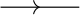
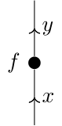
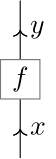

この記事は，TikZでモノイダル圏のストリング図式を描く方法の自分用備忘録である．
<!-- 改善点を思いついた場合は教えていただけると筆者がとても喜びます． -->

:::note alert
**構文文末のセミコロン `;` を忘れてはいけない！！！**
:::

# 有用なTikZライブラリ

以下のライブラリ & パッケージがあれば，2次元の図ならば大体なんでも描けそうな気がしてくる．

```TeX
\usepackage{tikz}
\usetikzlibrary{
    intersections,
    decorations,
    calc,
    patterns,
    through,
    positioning,
    arrows,
    shapes,
    backgrounds,
    cd,
    spath3,
    knots
}
```

# 便利なtikzset

`\coordinate, \node, \draw` などのコマンドの細かいオプションをいちいち指定するのは面倒なので，プリアンブルなどに `\tikzset{中身}` を書いてよく使うオプションの設定に名前をつけて保存しておくと良い．以下では  `\tikzset{中身}` の `中身` として有用そうな例をいくつか紹介する．

:::note warn
ここで紹介する`tikzset`は以降の具体例のほとんどいたるところで使用するので，一度は確認してください．
:::

## 線の中間の矢印

```TeX
->-/.style={
    decoration={
        markings,
        mark=at position #1 with {\arrow{>}}
    },
    postaction={decorate}
}
-<-/.style={
    decoration={
        markings,
        mark=at position #1 with {\arrow{<}}
    },
    postaction={decorate}
}
```
引数には矢印の位置を代入する．

```TeX:使用例
\begin{tikzpicture}
    \path coordinate (s)
    ++(1,0) coordinate (t)
    ;
    \draw[->-=.5] (s) -- (t);
\end{tikzpicture}
```
<!--  -->

矢印のスタイルが気に入らない場合は `\arrow{...}` の部分を変更すれば良い．

<!--  -->

- 矢印のサイズ調整の詳細は [公式ドキュメントの **16.3.1 Size** の項目](https://tikz.dev/tikz-arrows) を参照．
- 矢印の位置調整の詳細は [公式ドキュメントの `/pgf/decoration/mark` の項目](https://tikz.dev/library-decorations#autosec-5466) を参照．

## 点

```TeX
bullet/.style={
    circle,fill,
    inner sep=2pt,
    label={#1}
}
```
ストリング図式としては，モノイダル圏の射を表す．

```TeX:使用例
\begin{tikzpicture}
    \path coordinate (s)
    ++(0,1) coordinate[bullet,label=left:$f$] (f)
    ++(0,1) coordinate (t)
    ;
    \draw[->-=.25,->-=.75] (s) -- node[midway,right] {$x$} (f) -- node[midway,right] {$y$} (t);
\end{tikzpicture}
```

<!--  -->


## 箱

```TeX
squarednode/.style={
    rectangle, draw=black!60, minimum size=5mm
}
```
モノイダル圏の射を，点ではなく四角の箱で描くこともある．この記事では点で描く流儀を採用するが，参考までに載せておく．

```TeX:使用例
\begin{tikzpicture}
    \path coordinate (s)
    ++(0,1) coordinate[squarednode,label=center:$f$] (f)
    ++(0,1) coordinate (t)
    ;
    \draw[->-=.25,->-=.75] (s) -- node[midway,right] {$x$} (f) -- node[midway,right] {$y$} (t);
\end{tikzpicture}
```
<!--  -->


## バツ印

TikZのデフォルトのオプションにはバツ印が存在しないらしい．

```TeX
cross/.style={
    cross out, draw=black, fill=none, minimum size=1mm, inner sep=0pt, outer sep=0pt
}
```

# TikZの基礎

TikZの図は，座標点と，それらの間を繋ぐ曲線から構成されている．
`\path ... ;` の構文が基本だが，略記として座標指定に特化した `\coordinate ... ;`，ラベル付き頂点の描画に特化した `\node ... ;` や，曲線の描画に特化した `\draw ... ;` コマンドが用意されている．

## 座標の指定

- 絶対座標を指定する方法と，相対座標を指定する方法の2通りがある．
- どちらの場合でも座標の指定にはデカルト座標（cm） `(x,y)` と極座標（度数法） `(θ:r)` の両方が使える．
- オプションで描画スタイルやラベルを指定することができる．

点が少ない場合は絶対座標でも良いが，点が多い場合は相対座標を使うと便利だと思う．

:::note info
曲線の交点の座標を `[intersections={of=curve1 and curve2, ...}]` で算出したり，重み付き重心を `(barycentric cs: v1=a1, v2=a2, ...)` で算出するなど，既存のオブジェクトをもとに新しい座標を指定することもできる．詳細は [公式ドキュメントの **13 Specifying Coordinates**](https://tikz.dev/tikz-coordinates#autosec-557) を参照．
:::

### 絶対座標

```TeX
\path coordinate[オプション] (名前) at (座標) ... ;
```
または
```TeX
\coordinate[オプション] (名前) at (座標);
```

:::note info
`\path coordinate ...;` の最初の座標は，`at` で具体的に指定しない場合は自動的に原点になる．
:::

### 相対座標

```TeX
\path 
    coordinate[option1] (name1)
    +(相対座標2) coordinate[option2] (name2)
    +(相対座標3) coordinate[option3] (name3)
    ...
;
```
とすると，`(name3) = (name1) + (相対座標3)` となる．一方で
```
\path 
    coordinate[option1] (name1)
    ++(相対座標2) coordinate[option2] (name2)
    +(相対座標3) coordinate[option3] (name3)
    ...
;
```
とすると，`(name3) = (name2) + (相対座標3)` となる．相対座標の指定にはデカルト座標と極座標の両方が使える．

### ラベルの貼り方

`coordinate[label=ラベル位置:ラベル内容, ... other options ...]` と書く．`ラベル位置` はデフォルトだと

- `above`
- `below`
- `right`
- `left` 
- `above right` 
- `above left` 
- `below right` 
- `below left` 

が用意されている．より細かく指定したい場合は `above=2mm` のようにする．

```TeX:使用例
\begin{tikzpicture}[
    dot/.style={circle,fill,inner sep=1pt}
]
    \path 
        coordinate (O) % 原点
        coordinate[dot,label=above right:$a$] (a) at (1.5,1.5)  % デカルト座標
        coordinate[dot,label=below left:$b$] (b) at (120:1) % 極座標
        ++(0,-1) coordinate[dot,label=above:$c$] (c)  % 相対座標 (デカルト座標)
        ++(45:{sqrt(2)}) coordinate[dot,label=above:$d$] (d) % 相対座標 (極座標)
    ;
    % ===== 以下，座標の指定と関係のない部分 ===== 
    % xy座標軸
    \draw[->] (O) -- +(2,0) node[right] {$x$};
    \draw[->] (O) -- +(0,2) node[above] {$y$};
\end{tikzpicture}
```
<!--  -->


### 座標の計算（やや発展的）

工事中

## 曲線の描画

- 描画に必要な点を予め指定しておく．
- `\draw[option] (座標1) 繋ぎ方 (座標2) 繋ぎ方 (座標3) ... ;` で点を繋ぐ．
- 点を繋ぐ主な方法は，主に以下の4通りである：
    - 折れ線
    - `to[out=発射角,in=入射角]`
    - [Bezier曲線](https://ja.wikipedia.org/wiki/%E3%83%99%E3%82%B8%E3%82%A7%E6%9B%B2%E7%B7%9A) 
    - 円・楕円・弧

### 折れ線

```TeX
\draw[option] (座標1) -- (座標2) -- (座標3) -- ... ;
```
と書く．直線の中点にラベルを貼りたいときは
```TeX
\draw[option] (座標1) -- node[midway, ラベル位置] {ラベル} (座標2);
```
と書く．

```TeX:使用例
\begin{tikzpicture}
    % 座標の指定
    \path 
        coordinate[bullet,label=above:$f$] (f)
        foreach \i in {0,1,2} {
            +({30+120*\i}:2) coordinate (v_\i)
        }
    ;
    % 直線の描画
    \draw[->-=.5] (v_2) -- node[midway, right] {$a$} (f);
    \draw[->-=.5] (f) -- node[midway, below right] {$c$} (v_0);
    \draw[->-=.5] (f) -- node[midway, below left] {$b$} (v_1);
\end{tikzpicture}
```


### to path


```TeX
\draw[option] (座標1) to[out=発射角,in=入射角,looseness=実数, ...] (座標2);
```
と書く．`looseness` の値は実数値で，大きいほど「膨らみ」が大きくなる．デフォルトは `looseness=1` である．
詳細は[公式ドキュメントの **74 To Path Library**](https://tikz.dev/library-edges) を参照．

```TeX:使用例
\begin{tikzpicture}
    \path 
        coordinate (a)
        ++(3,0) coordinate (b)
    ;
    \draw[->-=.5] (a) to[out=90,in=90] node[midway,above] {\scriptsize\texttt{looseness=1}} (b);
    \draw[->-=.5] (a) to[out=90,in=90,looseness=2] node[midway,above] {\scriptsize\texttt{looseness=2}} (b);
\end{tikzpicture}
```


### Bezier曲線

```TeX
\draw[option] (座標1) .. controls (ctrl) .. (座標2);
```
もしくは
```TeX
\draw[option] (座標1) .. controls (ctrl_1) and (ctrl_2) .. (座標2);
```
と書く．制御点 `(ctrl), (ctrl_1), (ctrl_2)` は座標で指定する．
曲線のパラメータ表示は

- 制御点が1つの場合：
```math
B(t) = (1-t)^2 P_0 + 2(1-t)t P_1 + t^2 P_2
```
- 制御点が2つの場合：
```math
B(t) = (1-t)^3 P_0 + 3(1-t)^2t P_1 + 3(1-t)t^2 P_2 + t^3 P_3
```

である．直観的には，始点と終点を繋ぐ曲線を制御点方向に**順番に**引っ張った結果生じる曲線になっている．

```TeX:使用例
\begin{tikzpicture}
    \path 
        coordinate (a)
        +(0,3) coordinate[label=above:1] (ctrlab_1)
        ++(3,0) coordinate (b)
        +(0,3) coordinate[label=above:2] (ctrlab_2)
        ++(1,0) coordinate (c)
        +(0,3) coordinate[label=above:1] (ctrlcd_1)
        ++(3,0) coordinate (d)
        +(0,-3) coordinate[label=below:2] (ctrlcd_2)
    ;
    \draw[->-=.5] (a) .. controls (ctrlab_1) and (ctrlab_2) .. (b);
    \draw[->-=.5] (c) .. controls (ctrlcd_1) and (ctrlcd_2) .. (d);

    % ===== control points =====
    \foreach \i in {1,2} { 
        \node[cross] at (ctrlab_\i) {}; 
        \node[cross] at (ctrlcd_\i) {}; 
    }
    % \draw[dashed] (c) -- foreach \i in {1,2} { (ctrlcd_\i) node[cross] at (ctrlcd_\i) {} -- } (d);
    \draw[dashed] (a) -- (ctrlab_1) -- (ctrlab_2) -- (b);
    \draw[dashed] (c) -- (ctrlcd_1) -- (ctrlcd_2) -- (d);
\end{tikzpicture}
```


## 円・楕円・弧

### 円

```TeX
\draw[option] (中心座標) [radius=半径];
```

### 楕円

```TeX
\draw[option] (中心座標) [x radius= ..., y radius= ...];
```

### 弧

```TeX
\draw[option] (x,y) arc (α:β:r);
```
と書く．書くパラメータは

- `(x,y)` : 始点の座標
- `α` : 始点の角度（度数法）
- `β` : 終点の角度（度数法）
- `r` : 半径

となっている．つまり，
```math
x(t) = x - r \cos(\alpha) + r \cos(t),
```
```math
y(t) = y - r \sin(\alpha) + r \sin(t)
```
```math
t \in [\alpha,\, \beta]
```
という曲線を描画する．

```TeX:使用例
\begin{tikzpicture}[
    dot/.style={circle,fill,inner sep=1pt}
]
    \path 
        coordinate (O)
        ++(4,2) coordinate[dot,label=right:$x$] (s)
    ;
    \draw[->-=.5] (s.center) arc (30:120:3);

    % ===== 各種パラメータの説明 =====
    \draw[->] (O) -- +(2,0) node[right]{$x$};
    \draw[->] (O) -- +(0,2) node[above]{$y$};

    \node[red,cross] (C) at ($(s.center) - 3*({cos(30)}, {sin(30)})$) {};
    \draw[red,dashed] (C) -- (s.center);
    \draw[blue,dashed] (C) -- +(120:3);
    \draw[dashed] (C) -- +(1,0) coordinate (ref);
    \draw[red] (ref) arc (0:30:1) node[midway, right] {$\alpha$};
    \draw[blue] ($(ref) + (-0.2,0)$) arc (0:120:0.8) node[midway, right] {$\beta$};
\end{tikzpicture}
```


## 数式にTikZの図を埋め込む方法

`tikzpicture` 環境の `baseline` オプションを上手く調整して，高さ方向の中心を揃える（参考[https://tex.stackexchange.com/questions/75194/align-an-equation-and-a-tikz-picture-with-anchor-and-baseline](https://tex.stackexchange.com/questions/75194/align-an-equation-and-a-tikz-picture-with-anchor-and-baseline)）．

```TeX
\begin{align}
    \begin{tikzpicture}[baseline={([yshift=-.5ex]current bounding box.center)}]
        ...
    \end{tikzpicture}
\end{align}
```

# 応用例：ストリング図式

ここまでの準備だけで，様々なストリング図式を描くことができる．

## F-シンボルの定義式

数学としての解説は[他所](https://ncatlab.org/nlab/show/6j%20symbol)に譲り，フュージョン圏において **F-symbol** と呼ばれるものの定義式を書いてみる：

```TeX:例

\begin{align}
    \begin{tikzpicture}[baseline={([yshift=-.5ex]current bounding box.center)}]
        \path coordinate (a)
        ++(0,1) coordinate[bullet,label=left:$v_1$] (v_1)
        +(60:2) coordinate (d)
        ++(120:1) coordinate[bullet,label=left:$v_2$] (v_2)
        +(60:1) coordinate (c)
        +(120:1) coordinate (b)
        ;
        \draw[->-=.2,->-=.7] (a) -- node[midway, right] {$a$} (v_1) -- node[midway, right] {$d$} (d);
        \draw[->-=.3,->-=.7] (v_1) -- node[midway, above right] {$x$} (v_2) -- node[midway, left] {$b$} (b);
        \draw[->-=.5] (v_2) -- node[midway,right] {$c$} (c);
    \end{tikzpicture}
    &\quad \eqqcolon \sum_{\substack{\textcolor{red}{y} \in \mathrm{Simp}(\mathcal{C}), \\ \textcolor{red}{u_1} \in \mathrm{Basis}(a,\, b \otimes \textcolor{red}{y}), \\ \textcolor{red}{u_2} \in \mathrm{Basis}(\textcolor{red}{y},\, c \otimes d)}} 
    (F^{bcd}_a)_{(x;\, v_1,\, v_2),\, (\textcolor{red}{y;\, u_1,\, u_2})}
    \begin{tikzpicture}[baseline={([yshift=-.5ex]current bounding box.center)}]
        \path coordinate (a)
        ++(0,1) coordinate[bullet,red,label=right:$\textcolor{red}{u_1}$] (u_1)
        +(120:2) coordinate (b)
        ++(60:1) coordinate[bullet,red,label=right:$\textcolor{red}{u_2}$] (u_2)
        +(120:1) coordinate (c)
        +(60:1) coordinate (d)
        ;
        \draw[->-=.2,->-=.7] (a) -- node[midway, left] {$a$} (u_1) -- node[midway, left] {$b$} (b);
        \draw[->-=.3,->-=.7] (u_1) -- node[midway, above left, red] {$y$} (u_2) -- node[midway, right] {$d$} (d);
        \draw[->-=.5] (u_2) -- node[midway, left] {$c$} (c);
    \end{tikzpicture}
\end{align}
```


## evaluation, coevaluation

[rigidなモノイダル圏](https://ncatlab.org/nlab/show/rigid+monoidal+category) においては，任意の対象 $x$ に対して **(left/right) evaluation/coevaluation** という射

```math
\mathrm{ev}^{\mathrm{L}}_x \colon x^* \otimes x \longrightarrow 1
```

```math
\mathrm{coev}^{\mathrm{L}}_x  \colon 1 \longrightarrow x \otimes x^*
```

```math
\mathrm{ev}^{\mathrm{R}}_x \colon x \otimes {}^* x \longrightarrow 1
```

```math
\mathrm{coev}^{\mathrm{R}}_x  \colon 1 \longrightarrow {}^* x \otimes x
```

が存在して，**zig-zag 恒等式**と呼ばれる条件を満たす．これらの射をストリング図式としてTikZで書く時は，例えば
```TeX
\newcommand{\LEV}[2]{
    \draw[-<-=.2,-<-=.8] (#1) to[out=90,in=90,looseness=2] (#2);
}
\newcommand{\LCOEV}[2]{
    \draw[-<-=.2,-<-=.8] (#1) to[out=-90,in=-90,looseness=2] (#2);
}
\newcommand{\REV}[2]{
    \draw[->-=.2,->-=.8] (#1) to[out=90,in=90,looseness=2] (#2);
}
\newcommand{\RCOEV}[2]{
    \draw[->-=.2,->-=.8] (#1) to[out=-90,in=-90,looseness=2] (#2);
}
```
のようにマクロを定義してしまうのが良い．ここで，第1引数に渡す座標が左側のテンソル因子を表すように定義している．


このマクロを使って4つあるzig-zag 恒等式のうちの一つをTikZで書いてみると，次のようになる：

```TeX
\begin{tikzpicture}[baseline={([yshift=-.5ex]current bounding box.center)}]
    \path coordinate (x_1)
    ++(1,0) coordinate (x_2)
    ++(1,0) coordinate (x_3)
    ;
    \LCOEV{x_1}{x_2}
    \LEV{x_2}{x_3}
    \draw[-<-=.5] (x_1) -- +(0,1);
    \draw[->-=.5] (x_3) -- +(0,-1);
\end{tikzpicture}
&\quad = \quad 
\begin{tikzpicture}[baseline={([yshift=-.5ex]current bounding box.center)}]
    \path coordinate (x);
    \draw[->-=.5] (x) --node[midway, right] {$x$} (0,2);
\end{tikzpicture}
```


## BraidingとYang-Baxter方程式

工事中

## Ribbon構造

工事中

# 参考文献

- [PGF/TikZ Manual](https://tikz.dev/)
- Ralf Hinze & Dan Marsden, [How to Draw (String Diagrams)](https://stringdiagram.com/wp-content/uploads/2023/11/howtodrawv0.4.pdf), (2023)

